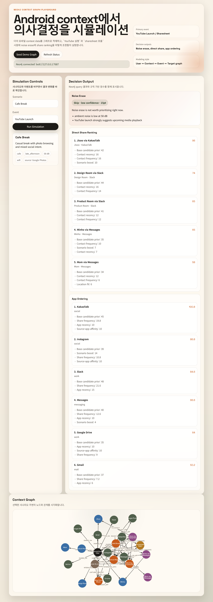
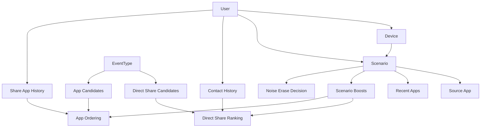

# Context Graph Demo

`Neo4j`를 활용해 Android mobile context data 기반 의사결정을 시뮬레이션하는 웹 데모입니다.

이 데모는 다음 질문을 빠르게 실험하는 용도로 만들었습니다.

- `YouTube` 앱이 실행됐을 때 지금 `noise erase`를 켜야 하는가
- `sharesheet`가 열렸을 때 `direct share`와 일반 `app` 순서를 어떻게 재정렬해야 하는가
- 이런 판단을 `user / device / scenario / app / contact / share target / event` 그래프로 설명할 수 있는가



## What This Demo Shows

- Android context를 `Neo4j graph`로 모델링하는 최소 예제
- `YouTube Launch`, `Sharesheet Open` 이벤트에 대한 시뮬레이션
- `noise erase` 추천 여부와 점수
- `direct share` 상위 후보와 기여 점수
- `app ordering` 재정렬 결과와 기여 점수
- 선택한 시나리오 주변의 graph 시각화

## Architecture



## Demo Flow

1. `Scenario`를 고릅니다. 예: `Morning Commute`, `Office Focus Block`
2. `Event`를 고릅니다. 예: `YouTube Launch`, `Sharesheet Open`
3. 서버가 `Neo4j`에서 시나리오 주변 graph와 이력 데이터를 조회합니다.
4. 룰 기반 점수와 graph 관계를 합쳐 `noise erase`, `direct share`, `app ordering` 결과를 계산합니다.
5. 브라우저에서 추천 결과와 graph 구조를 같이 확인합니다.

## Recommended Scenarios

가장 데모 효과가 큰 조합은 아래 2개입니다.

### 1. Morning Commute + YouTube Launch

- 높은 주변 소음
- 이동 중
- 이어버드 활성
- `noise erase` 우선순위가 높게 계산됨
- `KakaoTalk`, `Messages` 계열 공유가 위로 올라감

### 2. Office Focus Block + Sharesheet Open

- 조용한 환경
- 집중 모드 활성
- `noise erase`는 비추천
- `Slack`, `Drive`, `Gmail` 같은 업무 앱이 상위로 정렬됨

## Graph Model

### Node Types

- `User`
- `Device`
- `Scenario`
- `App`
- `Contact`
- `ShareTarget`
- `EventType`

### Core Relationships

- `(:User)-[:USES_DEVICE]->(:Device)`
- `(:User)-[:EXPERIENCES]->(:Scenario)`
- `(:Scenario)-[:SOURCE_APP]->(:App)`
- `(:Scenario)-[:RECENT_APP]->(:App)`
- `(:Scenario)-[:BOOSTS { eventType: "sharesheet_open" }]->(:ShareTarget|:App)`
- `(:EventType)-[:HAS_DIRECT_CANDIDATE]->(:ShareTarget)`
- `(:EventType)-[:HAS_APP_CANDIDATE]->(:App)`
- `(:User)-[:INTERACTED_WITH]->(:Contact)`
- `(:User)-[:SHARED_VIA]->(:App)`

## Included Dummy Scenarios

- `Morning Commute`
- `Office Focus Block`
- `Cafe Break`
- `Home at Night`

각 시나리오는 아래 context signal을 포함합니다.

- `timeOfDay`
- `locationType`
- `motionState`
- `noiseDb`
- `bluetoothAudio`
- `wearingBuds`
- `focusMode`
- `batteryPct`
- `network`
- `sourceAppId`

## Decision Logic

### Noise Erase

`noise erase` 추천은 아래 신호를 사용합니다.

- 주변 소음(`noiseDb`)
- Bluetooth / earbuds 오디오 경로
- 이동 상태(`motionState`)
- 이벤트 타입(`youtube_launch`, `sharesheet_open`)
- 집중 모드(`focusMode`)

예:

- `commute-morning + youtube_launch`는 높은 소음 + 이동 중 + 이어버드 활성 상태라서 점수가 높습니다.
- `office-focus + sharesheet_open`는 조용한 환경 + 시각적 상호작용 중심이라서 우선순위가 낮습니다.

### Direct Share Ranking

`sharesheet_open`에서 direct share 후보는 아래 신호를 합산합니다.

- 기본 prior score
- 시나리오별 boost
- 사용자 contact 상호작용 빈도
- contact 최근성
- 현재 시나리오에서 해당 채널 앱의 최근 사용 여부
- location fit

### App Ordering

앱 순서 재정렬은 아래 신호를 합산합니다.

- 기본 prior score
- 시나리오별 boost
- 사용자 app 공유 이력
- 최근 app 사용 여부
- 현재 source app과 target app 간 affinity

## Quick Start

### 1. Neo4j 준비

가장 간단한 방법은 `Docker`입니다.

```bash
docker compose up -d
```

기본 접속 정보:

- Browser: [http://localhost:7474](http://localhost:7474)
- Bolt: `bolt://127.0.0.1:7687`
- User: `neo4j`
- Password: `contextgraph123`

`Neo4j Desktop`을 쓰는 경우에도 같은 값으로 맞추면 됩니다.

### 2. 환경변수 준비

```bash
copy .env.example .env
```

AuraDB 또는 별도 인스턴스를 쓰는 경우 `.env`의 `NEO4J_URI`, `NEO4J_USER`, `NEO4J_PASSWORD`를 변경하면 됩니다.

### 3. 의존성 설치

```bash
npm install
```

### 4. 웹 서버 실행

```bash
npm run dev
```

브라우저에서 [http://localhost:3000](http://localhost:3000) 을 엽니다.

### 5. 더미 데이터 적재

UI의 `Seed Demo Graph` 버튼을 누르거나:

```bash
npm run seed
```

## API

- `GET /api/health`
- `POST /api/seed`
- `GET /api/scenarios`
- `GET /api/graph/:scenarioId`
- `POST /api/simulate`

예시 요청:

```json
{
  "scenarioId": "office-focus",
  "eventType": "sharesheet_open"
}
```

## Repository Layout

```text
.
├─ public/        # web UI
├─ scripts/       # manual seed script
├─ src/
│  ├─ data.js     # dummy Android context data
│  ├─ neo4j.js    # Neo4j connection helper
│  ├─ seed.js     # graph seed logic
│  └─ simulation.js
├─ server.js      # express API + static hosting
└─ docker-compose.yml
```

## Extension Ideas

- 실제 Android telemetry를 모방한 timestamped event stream 추가
- `Location`, `Activity`, `AudioRoute`, `NotificationState` 같은 노드 타입 세분화
- Cypher 기반 추천 설명 강화
- 동일한 event에 대해 rule-based와 graph-based ranking 비교
- Neo4j Bloom 또는 Browser와 연결해 별도 그래프 탐색 화면 제공
